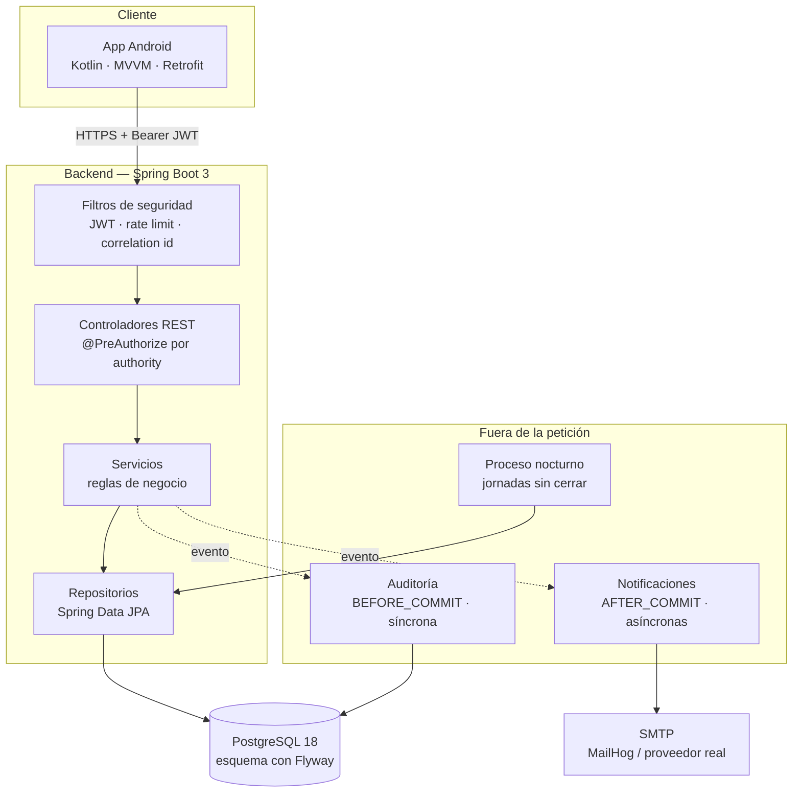
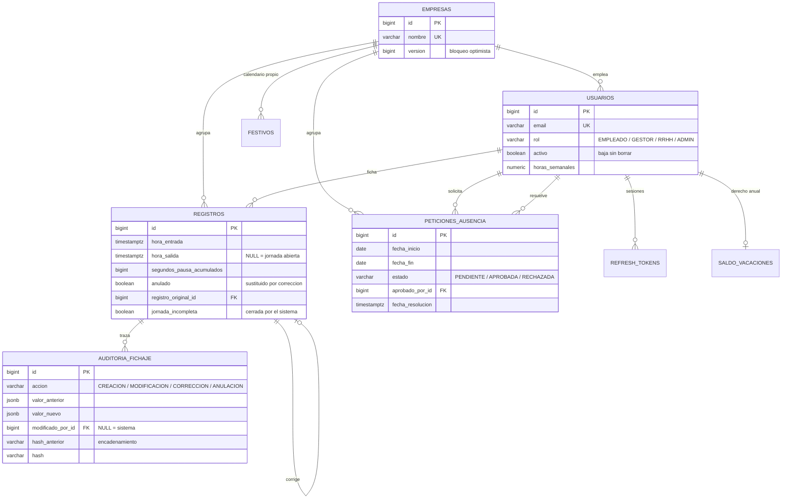

# NX Time

[](https://github.com/m-alfonsovillamil/NX-Time/actions/workflows/ci.yml)
[](https://openjdk.org/projects/jdk/21/)
[](https://spring.io/projects/spring-boot)
[](https://www.postgresql.org/)
[](LICENSE)

Sistema de **registro horario laboral**: una API REST en Spring Boot y una app
Android nativa que la consume. Los empleados fichan su jornada y solicitan
ausencias; los gestores aprueban, consultan a su equipo y exportan los informes
que exige la normativa.

En España el registro de jornada es **obligatorio** desde el RD-ley 8/2019, que
además exige conservar los registros cuatro años y que sean fiables. Ese
requisito no es decorativo aquí: condiciona el modelo de datos, la auditoría y
buena parte de las decisiones técnicas del proyecto.

---

## Índice

- [Qué tiene de interesante](#qué-tiene-de-interesante)
- [Stack](#stack)
- [Arranque en un comando](#arranque-en-un-comando)
- [Arquitectura](#arquitectura)
- [Modelo de datos](#modelo-de-datos)
- [API](#api)
- [Roles y permisos](#roles-y-permisos)
- [Tests](#tests)
- [Despliegue](#despliegue)
- [Decisiones de diseño (ADR)](#decisiones-de-diseño-adr)
- [Estado y limitaciones conocidas](#estado-y-limitaciones-conocidas)

---

## Qué tiene de interesante

Más allá del CRUD, estos son los puntos donde el proyecto toma decisiones que
merece la pena mirar:

**Auditoría de fichajes que no se puede alterar.** Cada cambio sobre un fichaje
queda registrado en una tabla *append-only*, con el valor anterior y el nuevo en
JSONB y un **encadenamiento de hashes** (cada fila guarda el SHA-256 de la
anterior), de forma que manipular una fila antigua invalida todas las
siguientes. Corregir un fichaje **nunca sobrescribe**: anula el original y crea
uno nuevo enlazado. El bloqueo de `UPDATE`/`DELETE` se aplica **por trigger**, no
solo por permisos — porque los permisos resultaron no bastar en el proveedor de
producción, y eso está contado en [su ADR](docs/adr/003-auditoria-append-only.md).

**`Instant` y `TIMESTAMPTZ`, no `LocalDateTime`.** Un fichaje es un instante
concreto en el tiempo. Con `LocalDateTime` los cambios de hora de octubre y marzo
son ambiguos, y en un registro con valor legal eso no es aceptable. Las fechas de
vacaciones, en cambio, **sí** son `LocalDate`: "el 24 de diciembre" significa lo
mismo en cualquier zona. La distinción es deliberada
([ADR](docs/adr/002-instant-vs-localdatetime.md)).

**Autorización por authorities granulares.** Los endpoints no comprueban roles
(`hasRole('GESTOR')`) sino permisos concretos (`hasAuthority('ausencia:aprobar')`),
derivados del rol en un único sitio. Añadir un rol no obliga a tocar ningún
controlador ([ADR](docs/adr/005-authorities-granulares.md)).

**Multi-tenant real.** Cada empresa solo ve lo suyo, y hay tests que lo
verifican explícitamente cruzando datos entre dos empresas.

**Agregados en SQL, no en Java.** El panel de métricas usa `GROUP BY` en la base
de datos; traer miles de filas a memoria para sumarlas sería justo lo que no hay
que hacer.

---

## Stack

| Capa | Tecnología |
|---|---|
| Lenguaje | Java 21 |
| Framework | Spring Boot 3.5.6 (Web, Data JPA, Security, Validation, Mail, Cache, Actuator) |
| Base de datos | PostgreSQL 18 + Flyway (esquema versionado, escrito a mano) |
| Seguridad | JWT (jjwt 0.12.6) con *refresh tokens* revocables, BCrypt, Bucket4j |
| Mapeo | MapStruct 1.6.3 · Lombok |
| Documentación | springdoc-openapi (Swagger UI) |
| Informes | Apache POI (Excel) · OpenPDF (PDF) |
| Caché | Caffeine |
| Tests | JUnit 5 · Mockito · AssertJ · MockMvc · JaCoCo |
| Build | Gradle (Kotlin DSL), monorepo de dos módulos |
| App móvil | Kotlin 2.0 · Jetpack Compose (Material 3) · MVVM con `StateFlow` · navigation-compose · Retrofit |
| Infra | Docker multi-stage · GitHub Actions · Render + Neon |

---

## Arranque en un comando

Solo hace falta Docker: **no** necesitas Java, Gradle ni PostgreSQL instalados.

```bash
docker compose up -d --build
```

Levanta la API, PostgreSQL, Adminer y MailHog, y **siembra datos de ejemplo**:
dos empresas, once usuarios y unos tres meses de fichajes y ausencias.

| Servicio | URL |
|---|---|
| API | http://localhost:8080 |
| Swagger UI | http://localhost:8080/swagger-ui/index.html |
| Estado | http://localhost:8080/actuator/health |
| Adminer (base de datos) | http://localhost:8081 |
| MailHog (correos) | http://localhost:8025 |

**Credenciales de demo** (contraseña `demo1234` para todos):

| Usuario | Rol |
|---|---|
| `marta.sanchez@techcorp.demo` | GESTOR |
| `javier.lopez@techcorp.demo` | EMPLEADO |
| `pedro.navarro@iberica.demo` | GESTOR de **otra** empresa (útil para ver el aislamiento) |

### Desarrollo

Para trabajar en el backend es más cómodo levantar solo la base de datos y
ejecutar la aplicación desde el IDE, con recarga en caliente:

```bash
docker compose up -d postgres adminer mailhog
./gradlew :nx-time-backend:bootRun --args="--spring.profiles.active=dev,demo"
```

---

## Arquitectura



Las dos escuchas de eventos tienen **semántica opuesta a propósito**: la
auditoría corre *antes* del commit y de forma síncrona (si no se puede auditar,
no se ficha), y las notificaciones *después* del commit y en otro hilo (un correo
no se puede deshacer, y un fallo de SMTP no debe tumbar una operación ya
confirmada).

---

## Modelo de datos



Algunas garantías viven **en la base de datos**, no solo en el código:

- **Índice único parcial** sobre `registros(usuario_id) WHERE hora_salida IS NULL`:
  imposibilita dos jornadas abiertas a la vez, incluso ante dos peticiones
  simultáneas.
- **Triggers** que impiden `UPDATE`, `DELETE` y `TRUNCATE` sobre
  `auditoria_fichaje`.
- **`CHECK` de coherencia** en `peticiones_ausencia`: una petición resuelta
  siempre tiene resolutor y fecha; una pendiente, nunca.
- **`@Version`** (bloqueo optimista) en las entidades con concurrencia real.

---

## API

Documentación interactiva en **`/swagger-ui/index.html`**, con los códigos de
error documentados endpoint por endpoint. La especificación versionada está en
[`docs/openapi.json`](docs/openapi.json) y se puede importar en Postman o
Insomnia directamente.

Todos los errores siguen **RFC 7807 (`ProblemDetail`)**:

```json
{
  "type": "about:blank",
  "title": "Conflict",
  "status": 409,
  "detail": "Ya hay una jornada activa.",
  "instance": "/api/v1/fichaje"
}
```

Áreas: autenticación · fichaje · ausencias · gestión de empleados · auditoría ·
panel de métricas · informes.

---

## Roles y permisos

Cada rol hereda los permisos del anterior: **EMPLEADO < GESTOR < RRHH < ADMIN**.

| Rol | Además de lo anterior, puede |
|---|---|
| **EMPLEADO** | fichar, ver lo suyo, solicitar ausencias |
| **GESTOR** | ver y aprobar las de su equipo, crear empleados |
| **RRHH** | corregir fichajes, ver la auditoría, exportar informes, dar de baja |
| **ADMIN** | crear otros gestores |

Quien registra la empresa queda como **ADMIN**: es quien funda el tenant y quien
reparte el poder de gestión.

---

## Tests

### Backend

**224 tests**, todos contra PostgreSQL real — nunca H2, que miente sobre el
dialecto y no detecta los fallos que importan (índices parciales, JSONB,
`CHECK`).

```bash
docker compose up -d postgres      # los tests necesitan la base de datos
./gradlew :nx-time-backend:check   # tests + umbral de cobertura
```

| Tipo | Qué cubre |
|---|---|
| Unitarios (Mockito) | reglas de negocio: máquina de estados del fichaje, saldo de vacaciones, días hábiles |
| `@WebMvcTest` | rutas, authorities y validación de cada controlador |
| `@DataJpaTest` | consultas y aislamiento entre empresas |
| `@SpringBootTest` | flujos completos e invariantes que solo existen en la base de datos |
| Contrato | los endpoints que consume la app Android, extremo a extremo |

`check` falla si la cobertura de `service`, `controller` o `audit` baja del 60 %.
No se mide el resto (DTOs, entidades, configuración): forzar cobertura ahí solo
empuja a escribir tests de *getters*.

### App Android

**46 tests** de JVM, sin emulador. El CI los ejecuta junto con lint.

```bash
./gradlew :nx-time-frontend-android:testDevDebugUnitTest
./gradlew :nx-time-frontend-android:lintDevDebug   # abortOnError = true
```

| Qué cubre | Dónde |
|---|---|
| Transiciones de la jornada y las reglas que se resuelven sin ir al servidor | `FicharViewModelTest` |
| Validaciones de formulario antes de salir a la red | `LoginViewModelTest`, `SolicitudViewModelTest` |
| Motivo obligatorio al rechazar una ausencia | `AusenciasEquipoViewModelTest` |
| Que el `detail` del ProblemDetail llegue a la pantalla, y no el código HTTP | `ApiErrorParserTest` |
| Duración neta de la jornada y formatos de fecha | `DateFormatsTest` |

Se prueba lo que es lógica de la app, no lo que ya prueba el backend. **La
interfaz no está cubierta**: ver las limitaciones conocidas al final.

---

## Despliegue

Guía completa en **[`docs/DESPLIEGUE.md`](docs/DESPLIEGUE.md)**: Docker
multi-stage (imagen final de 411 MB, usuario no-root, capas cacheables),
GitHub Actions, y Render + Neon con las variables ya convertidas al formato que
necesita Spring.

El CI ejecuta los 224 tests contra un PostgreSQL real en cada push, con la misma
versión mayor que producción.

---

## Decisiones de diseño (ADR)

Las decisiones no obvias están justificadas en [`docs/adr/`](docs/adr/):

1. [PostgreSQL en vez de SQLite](docs/adr/001-postgresql-sobre-sqlite.md)
2. [`Instant` en vez de `LocalDateTime`](docs/adr/002-instant-vs-localdatetime.md)
3. [Auditoría propia, y append-only por trigger](docs/adr/003-auditoria-append-only.md)
4. [Java en vez de Kotlin](docs/adr/004-java-sobre-kotlin.md)
5. [Authorities granulares en vez de roles](docs/adr/005-authorities-granulares.md)
6. [Multi-tenant por discriminador](docs/adr/006-multitenant-por-discriminador.md)

---

## Estado y limitaciones conocidas

Lo que está hecho y lo que no, sin adornos:

**Funcionando:** la API completa, la app Android en Jetpack Compose y
sincronizada con ella, el esquema desplegado en Neon, el CI en verde y los
informes en Excel y PDF.

**Pendiente:**

- **Capturas de la app**: este README todavía no las tiene, y con la reescritura
  en Compose hay que hacerlas de cero.
- **Servicio en Render sin crear**: la configuración está lista
  (`render.yaml`), falta darle al botón.
- **La app no tiene tests de interfaz**: hay 46 tests de JVM sobre los
  ViewModel, `ApiErrorParser` y el formateo de fechas, que el CI ejecuta junto
  con lint. Lo que no cubre nadie es la interfaz: **ninguna pantalla se ha
  ejecutado nunca**, ni en un emulador ni en un test. Con Robolectric podrían
  correr en la JVM sin necesidad de dispositivo.
- **Hay backend que la app no enseña**: el saldo de vacaciones, el panel de
  indicadores, los informes descargables y la traza de auditoría existen en la
  API y no tienen pantalla. La auditoría es justo lo que este README destaca
  arriba como lo más interesante del proyecto.
- **El cierre automático no se distingue en el historial**: la app no puede
  marcarlo porque `TimeEntryResponse` no lo expone; solo consta en la tabla de
  auditoría, con `modificado_por_id` a null.
- **El filtro del historial de equipo compara por nombre**: `SimpleUserDTO` solo
  envía `nombre`, así que dos empleados homónimos mezclarían sus jornadas al
  filtrar. Se arregla añadiendo el `id` a ese DTO.
- **El proceso nocturno cierra jornadas olvidadas de más de 16 h**, así que una
  abierta de madrugada puede seguir bloqueando al empleado hasta ~24 h. El fallo
  grave (quedar bloqueado *indefinidamente*) sí está resuelto y verificado.
- **`docs/openapi.json` se regenera a mano** tras cambiar un controlador.

---

## Licencia

[MIT](LICENSE).
