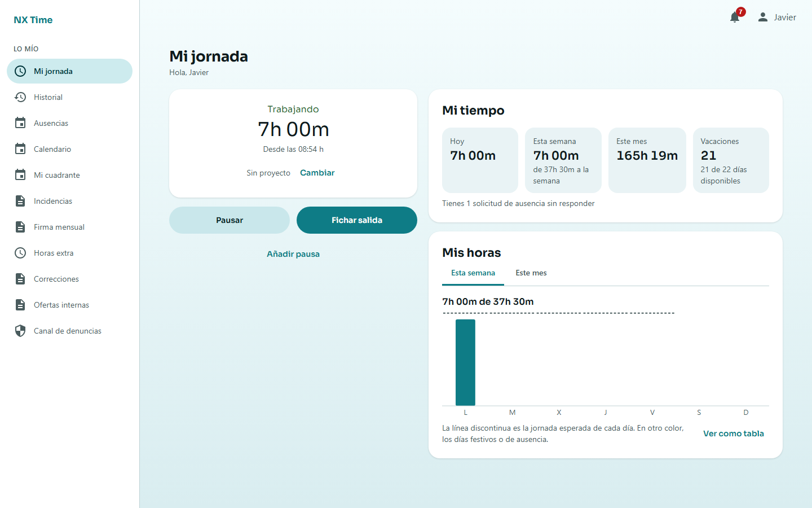
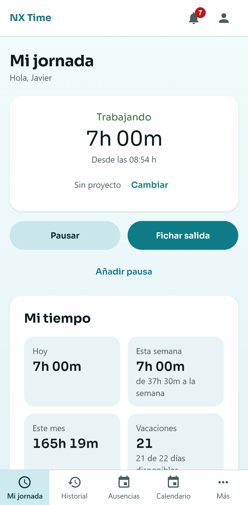

# nx-time-frontend-web

Cliente web de NX Time. **Está fuera del build de Gradle a propósito**: no
aparece en `settings.gradle.kts` ni en `settings-docker.gradle.kts`, tiene su
propio `npm` y sus propios workflows de CI (`web.yml` y `e2e.yml`). Quien solo
toque el backend no necesita Node instalado.

Hace **todo lo que hace la app Android**, más las tres pantallas que son solo de
la web: el **editor de cuadrantes**, la **analítica** completa y el **visado de
firmas** (plan de la web, fases W0-W8, [ADR 029](../docs/adr/029-la-web-alcanza-a-la-app.md)).
Está publicada en <https://nxtime-web.com>, funciona en el móvil (es el cliente
de quien tenga iPhone mientras no haya app de iOS) y la sesión sobrevive a
recargar ([ADR 030](../docs/adr/030-la-sesion-web-en-cookie.md)). Se puede
**instalar** y manda **notificaciones push**, que se encienden en Ajustes para
cada navegador ([ADR 031](../docs/adr/031-push-en-la-web.md)): el service
worker es `public/sw.js`, escrito a mano y sin el SDK de Firebase, y la página
solo usa el SDK para pedir el token (`src/push/push.ts`). Lo que no hace, y por
qué: el recordatorio de fichar y entrar con huella (ADR 029 y 031).

| Escritorio | Móvil |
|---|---|
|  |  |

```
src/
├── api/          schema.d.ts (generado) · cliente.ts · sesion.ts · useSesion.ts
│                 consultas.ts   TanStack Query: pedir(), useMutacion, listas por páginas
├── navegacion/   secciones.ts   EL catálogo: de aquí salen menú, rutas y destinos de avisos
│                 Marco.tsx · Campana.tsx
├── rutas/        rutas.tsx      guarda por authority, 403 y 404
├── paginas/      una carpeta por área (jornada, historial, ausencias, cuadrante,
│                 cuadrantes, analitica, plantilla, empresa...); cada página, su trozo de JS
├── componentes/  Basicos · CabeceraDePagina · Cifra · Estados · Iniciales · Tabla · Dialogo · Pestanas · Barras · Notificaciones · Icono
├── i18n/es/      un fichero por área; ningún texto literal en los componentes
├── estilos/      tokens.css (generado) · base.css
├── push/         push.ts (encender, apagar, el token sigue a la sesión) · PuenteDelServiceWorker.tsx
├── util/         fechas.ts · errores.ts · descargar.ts · numeros.ts · tema.ts
└── pruebas/      api.tsx        servidor de mentira tipado con el contrato
e2e/              Playwright contra el backend real: un recorrido por área, más
                  accesibilidad, teclado, móvil, carga por áreas y las capturas
public/           sw.js (el service worker) · manifest.webmanifest · iconos/
scripts/          tokens.mjs · presupuesto.mjs · iconos.mjs · medir.mjs
```

**Una sección nueva son dos pasos**: su línea en `navegacion/secciones.ts` y su
página. El menú, la ruta y el destino de aviso salen solos, y un test compara
el catálogo con `NoticeType.java` y `RoleAuthorities.java` del backend.

Lo que la página nueva tiene que respetar del sistema visual
([ADR 035](../docs/adr/035-sistema-visual-de-la-web.md)):

- **Su icono es solo suyo**: otro test falla si dos entradas del menú comparten
  dibujo. Los trazados están en `componentes/Icono.tsx`.
- **Empieza por `<CabeceraDePagina>`**, que saca el icono y la miga de la URL.
- **Ocupa el ancho** (`.nx-pagina`, hasta 1280 px) y se reparte con
  `.nx-composicion--principal-lateral`, `--mitades` o `--lista-detalle`. Nada
  de una columna estrecha centrada.
- **Lo que va con el color de la zona usa `--nx-acento*`** (teal en «Lo mío»,
  índigo en «Gestión»), y sobre un contenedor el texto es su `on-…-contenedor`.

## Los dos ficheros generados

Los dos se versionan aunque estén generados, y esa es la parte importante:
`npm run verificar:generado` los regenera y compara con `git diff
--exit-code`, así que **desincronizarse rompe el build en vez de pasar
desapercibido**. Lo ejecuta `.github/workflows/web.yml` en cada PR que toque
la web, **`docs/openapi.json` o el tema de Android** — esas dos últimas son lo
importante: quien deja desfasado un fichero generado casi nunca es un cambio en
la web, sino en lo que la web genera. El 21/09/2026 dos PR con el CI en verde
por separado dejaron el contrato desfasado al juntarse en `main`, porque quien
movió `docs/openapi.json` era un PR de backend.

| Fichero | Se genera desde | Comando |
|---|---|---|
| `src/api/schema.d.ts` | `../docs/openapi.json` | `npm run api:types` |
| `src/estilos/tokens.css` | `ui/theme/Color.kt`, `Type.kt` y `Shape.kt` de Android | `npm run tokens` |

`npm run generar` hace los dos.

**El contrato** lo produce `openapi-typescript`: solo tipos, cero runtime. Se
descartaron `orval` y `openapi-generator` porque escupen miles de líneas de
clases y un runtime propio, y para ~110 operaciones eso envejece peor que un
`.d.ts`. `docs/openapi.json` no se edita a mano: lo genera el backend
(`./gradlew :nx-time-backend:actualizarOpenApi`) y un test de snapshot lo
comprueba en cada build.

**Los tokens** salen del tema de la app Android porque el color de un botón no
puede tener dos verdades. Para cambiar un color, se cambia en `Color.kt` y se
ejecuta `npm run tokens`; editar `tokens.css` a mano dura hasta la siguiente
regeneración. El CSS lleva copiada en la cabecera la advertencia de contraste
de `Color.kt` — el par más justo de la paleta está a 4.67:1 — para que la lea
quien vaya a «ajustar un color».

## Comandos

```bash
npm install
npm run dev         # servidor de desarrollo en :5173
npm run generar     # tipos + tokens
npm test            # Vitest
npm run typecheck   # tsc del proyecto + el contrato generado
npm run build       # bundle de produccion en dist/
npm run presupuesto # tras el build: el JS inicial no pasa de 150 kB comprimido
npm run medir -- http://localhost:4173   # con `vite preview` y el backend de demo: peso, LCP, CLS y lo que tarda el menú
npm run e2e         # Playwright, y necesita backend (ver abajo)
npm run capturas    # las capturas de docs/capturas/web/, también contra el backend
npm run iconos      # los PNG de la web instalable, desde public/iconos/*.svg
```

La versión de Node está en `.node-version`, y la leen los tres sitios que la
usan —tu máquina con `fnm`/`nvm`, el CI y Render—, así que no pueden divergir sin
que se vea en un diff.

**Despliegue**: un *static site* de Render declarado en `render.yaml`, con la
CSP, la reescritura a `index.html` y las cabeceras de seguridad. Los pasos, y
el que hay que hacer a mano en el backend (CORS), están en
[`docs/DESPLIEGUE.md`](../docs/DESPLIEGUE.md#la-web).

El servidor de desarrollo manda `/api` y `/auth` al backend de `localhost:8080`
con su proxy, así que **no hay CORS mientras se desarrolla**. El precio es que
el CORS de verdad solo se comprueba al desplegar; por eso el backend avisa al
arrancar en producción si `CORS_ALLOWED_ORIGINS` está vacío.

`typecheck` pasa `tsc` dos veces a propósito. La segunda,
`typecheck:contrato`, compila `src/api/schema.d.ts` con `--skipLibCheck false`:
el proyecto lleva `skipLibCheck: true` (lo normal, para no gastar el build en
los `.d.ts` de las dependencias), y con él puesto un contrato generado roto
pasaría sin que nadie lo viera, porque es justamente un `.d.ts`.

## Las decisiones que conviene conocer antes de tocar nada

**El refresh va en una cookie que esta web no puede leer.** Desde la fase W1
([ADR 030](../docs/adr/030-la-sesion-web-en-cookie.md)) la web vive en
`nxtime-web.com` y la API en `api.nxtime-web.com`: el mismo sitio, así que el
servidor pone el refresh en una cookie `HttpOnly` y la sesión sobrevive a
recargar. El access sigue solo en memoria. Renovar y salir mandan la cabecera
`X-CSRF-Token`, copiada de la cookie `nx_csrf` (doble envío), y varias pestañas
renuevan de una en una con `navigator.locks`, porque el servidor rota el
refresh. **No hay `localStorage` para nada de la sesión.**

**El refresco del 401 se serializa.** El servidor rota el refresh token: dos
refrescos en paralelo significan que el segundo llega con un token ya usado, y
eso el servidor lo lee como una copia robada y revoca la sesión entera. Por eso
`cliente.ts` comparte una única promesa. No es una optimización; sin ella, tres
peticiones simultáneas echan a la gente. `cliente.test.ts` lo comprueba.

**Los datos pasan por TanStack Query y `pedir()`.** Cada `queryFn` es
`pedir(cliente.GET(...))`, que devuelve los datos o lanza un `ErrorDeApi` con el
`detail` del servidor listo para enseñar. Volver a la pestaña vuelve a
preguntar, y una escritura (`useMutacion`) invalida por clave lo que ha
cambiado. Los errores de un formulario se enseñan al lado del botón, no en una
notificación que se va sola.

**La URL es el destino del aviso.** El aviso `ausencias` lleva a `/ausencias`:
sin tabla de traducción. Una sección cuya página aún no existe está en el
catálogo con su fase (`llegaEn`); no sale en el menú y su aviso no navega.

**El estado de la jornada se pregunta, no se deduce.** `GET /fichaje/activo` y
el campo `enPausa` vienen del servidor en cada fichaje. Llevar la cuenta en el
cliente se desincroniza en cuanto alguien fiche desde el móvil con esta pestaña
abierta, que es justo el caso que esta pantalla existe para demostrar.

## Los tests de extremo a extremo

Pocos, y contra el backend de verdad. Los tests de Vitest cubren lo que se
puede razonar (con `pruebas/api.tsx`, cuyas claves son rutas del contrato: una
ruta mal escrita no compila); estos cubren lo único que ninguno de ellos puede
demostrar: que la web y el backend **hablan el mismo idioma**. En este proyecto
los defectos que se han escapado salieron todos ejecutando el sistema.

Están fuera de `npm test` a propósito, porque necesitan el sistema levantado.
**En el CI los ejecuta `.github/workflows/e2e.yml`** (fase W8) en cada PR que
toque la web o el código del backend: levanta Postgres, arranca el jar con los
perfiles `dev,demo` sobre una base recién creada, compila la web y la sirve con
`vite preview` (el build de producción, no el servidor de desarrollo). Si algo
falla, deja como artefacto el informe con la traza de cada test y el log del
backend. En local:

```bash
docker compose up -d postgres
./gradlew :nx-time-backend:bootRun --args="--spring.profiles.active=dev,demo"
npm run e2e          # contra `npm run dev`
CI=1 npm run e2e     # como en el CI: build + vite preview
```

Cada spec entra con el rol que le toca (EMPLEADO para lo suyo, que es el rol con
menos permisos y así se nota si una pantalla necesita alguno que no tiene;
GESTOR, RRHH o ADMIN para lo de gestión) y recorre sus pantallas contra los
datos de demo.

**Entrar con Google o con Microsoft** (ADR 036): `sso.spec.ts` hace el
recorrido entero en el navegador contra un proveedor de mentira,
`e2e/proveedor-oidc.mjs`, que tiene su página de «elige tu cuenta» y firma los
ID token. Es lo único que demuestra que las cookies sobreviven a la ida y la
vuelta y que la web retoma la sesión sola; las reglas (a quién se le cree el
correo, qué token no vale) las prueba el backend. El CI lo arranca y enciende
el SSO del backend apuntando a él. En local, sin eso, esas specs se saltan; para
correrlas, `node e2e/proveedor-oidc.mjs` y los parámetros que lleva la cabecera
de la spec.

**Accesibilidad** (fase W8): `accesibilidad.spec.ts` pasa axe (WCAG 2.1 A y AA)
por **todas** las páginas, en tema claro y oscuro. No lleva una lista de
páginas: cada cuenta de demo recorre su propio menú, así que una página nueva
entra sola. `teclado.spec.ts` comprueba lo que axe no ve: entrar, saltar el
menú, fichar y manejar un diálogo sin tocar el ratón. El contraste del título
sobre el degradado del fondo, que axe no sabe calcular, se midió a mano en los
dos extremos: el peor caso es 5,81:1 (claro) y 7,50:1 (oscuro).

**Móvil** (fase W8): `movil.spec.ts` corre en dos proyectos más, `movil`
(Chromium, un Pixel 7) e `iphone` (WebKit, el motor de Safari: la web es el
cliente de quien tenga iPhone). Comprueba la barra inferior con «Más», una
jornada entera con toques y que **ninguna página de ninguna cuenta se sale por
los lados**, ni la página ni una tabla dentro de su caja. Lo que no puede
probar es la recarga en WebKit: sobre `http://localhost`, WebKit no deja leer
ni envía las cookies `Secure` de la sesión (en producción, con https, no
aplica). Eso se comprueba a mano en un iPhone.

**Una spec no puede depender de lo que haya dejado otra.** En el CI la base es
nueva cada vez, así que lo que en local pasaba porque otra spec había fichado
antes, allí falla. Si una spec necesita un dato que la demo no siembra, lo crea
ella (ver `equipo.spec.ts`), y tiene que poder repetirse sobre una base ya usada.

## Por qué los tests están sobre `scripts/tokens.mjs`

El generador lee Kotlin con expresiones regulares, y una expresión regular
falla **en silencio**: no avisa de que ha dejado de encontrar un color,
devuelve uno menos. `scripts/tokens.test.mjs` cuenta las declaraciones del
`Color.kt` real y las compara con lo leído, comprueba que los dos temas
definan los mismos tokens, y fija la forma de la salida contra fixtures.

Ese test ya ha pagado: destapó que `aHexCss` validaba la longitud del literal
pero no el alfa, así que un `0x800E7C86` habría salido como `#0e7c86`,
**pintado opaco**, sin error.
